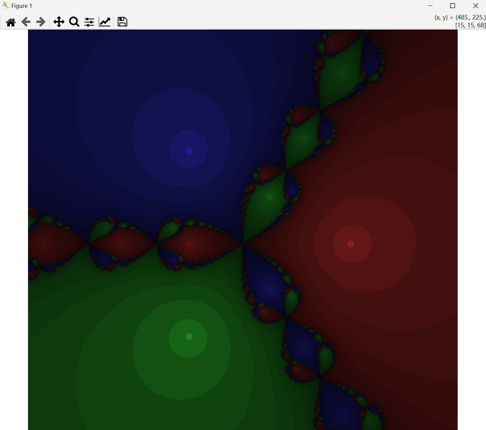
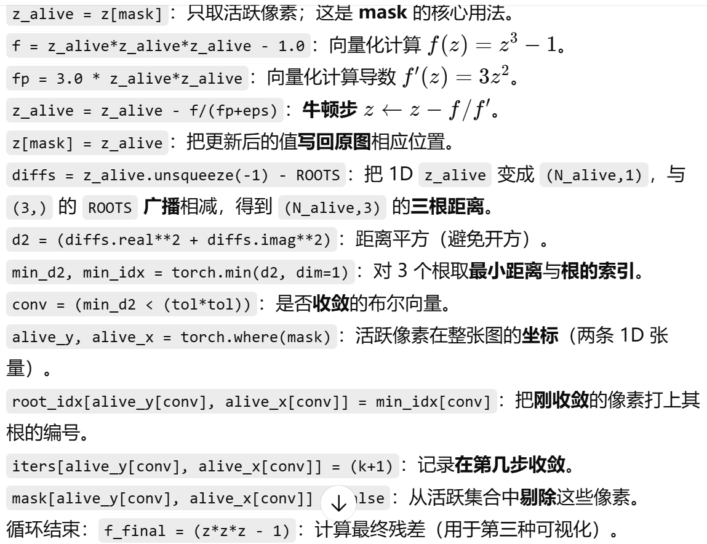
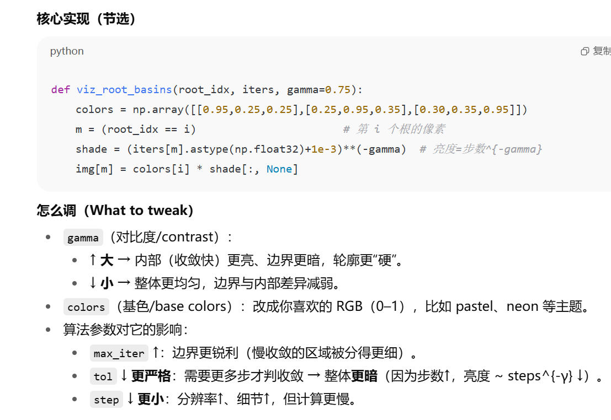
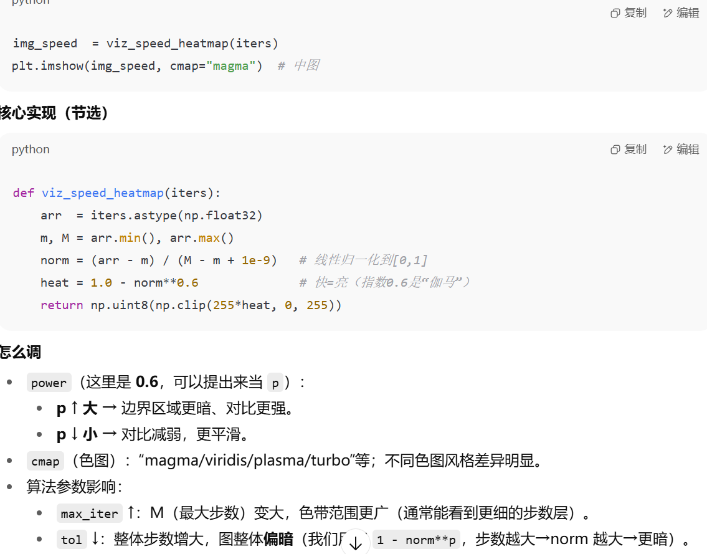
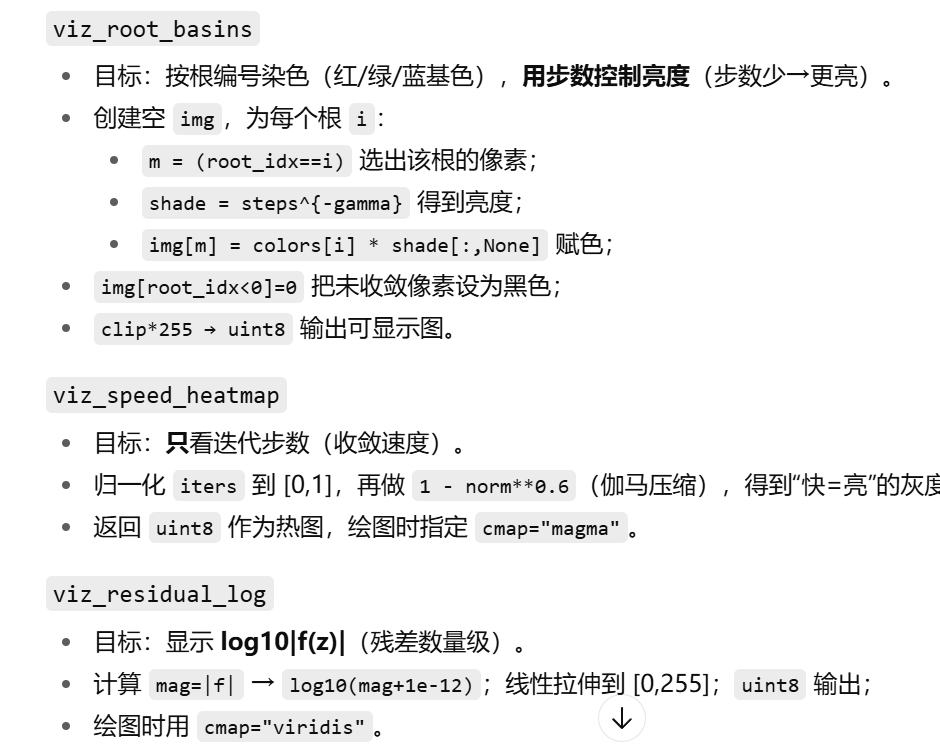

# MyFractal
COMP3710_DEMO1
## Project introduction
### Newton Fractal（PyTorch/GPU，vectorised + mask）
Newton iterative update + convergence determination

## operation method
* /src/NewtonFractal.py
1. vectorized on GPU (the entire grid tensor is updated in parallel)
   * I don’t have a pixel-by-pixel for loop; instead, I represent the entire image as a tensor, and all updates are element-wise + broadcasting + reduction, which triggers GPU kernels to execute in parallel.
2. mask (iterate only non-converged pixels, can stop early)
3. no grad (inference mode)
    * Fractal rendering is not training and does not require backpropagation of the gradient graph (computation graph) ; 分形渲染不是训练，不需要反向传播的 梯度图（computation graph）。
    * `torch.no_grad()` close autograd：
    * reduce storage 减少内存（不保存中间变量）
    * Reduce scheduling/meta-operation overhead 减少调度/元操作开销
    * Slightly improve throughput (especially noticeable at high iterations);小幅提升吞吐（尤其在高迭代时更明显）
4. root basins (coloring by root + velocity shading).
    * Different initial value points will eventually converge to different roots (attraction domains)
    * **root_idx** determines the base color (red/green/blue), and **iters** determines the brightness (faster convergence → brighter).root_idx 决定基色（红/绿/蓝），用 iters 决定亮度（收敛更快 → 更亮）。
    * Unconverged (-1) pixels are set to black for clear distinction未收敛（-1）像素设为黑色，清晰区分

1. device config
2. create complex grid
3. calculate (Calculate derivatives)
    
4. record convergence count

* visualise
左图调 gamma（basin 对比度）；中图调 p（步数热图对比度）；右图调 tol/max_iter/eps/cmap（残差亮度与风格）。全局的 step/max_iter/tol 决定“清晰度/速度/一致性”，越小步长、越大迭代、越严阈值 → 细节多但更慢
1. `viz_root_basins` Color by root number (red/green/blue base colors), and control brightness by number of steps (fewer steps → brighter) 按根编号染色（红/绿/蓝基色），用步数控制亮度（步数少→更亮）

shade：用于乘到颜色上的亮度（值越大越亮）
1. `viz_speed_heatmap` Only look at the number of iterations (convergence speed)只看迭代步数（收敛速度）
2. `viz_residual_log` Display log10|f(z)| （magnitude of residual）显示 log10|f(z)|（残差数量级）
 

## dependencies
* torch
* numpy 
* matplotlib
## what analysis/visualization have done
## location of AI usage records
/AI_usage_record.md

